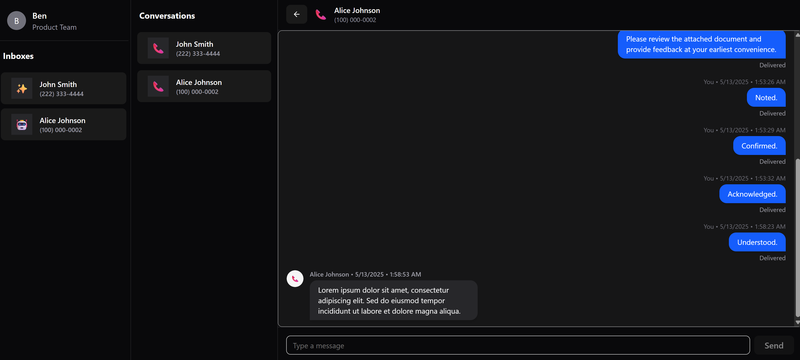
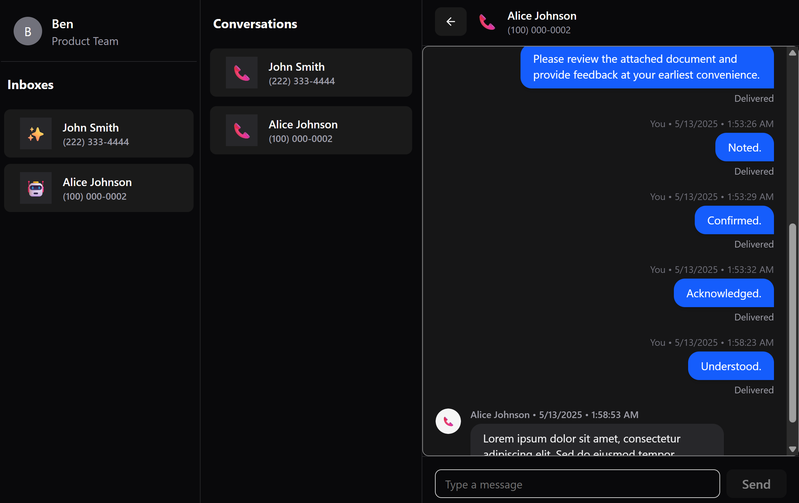
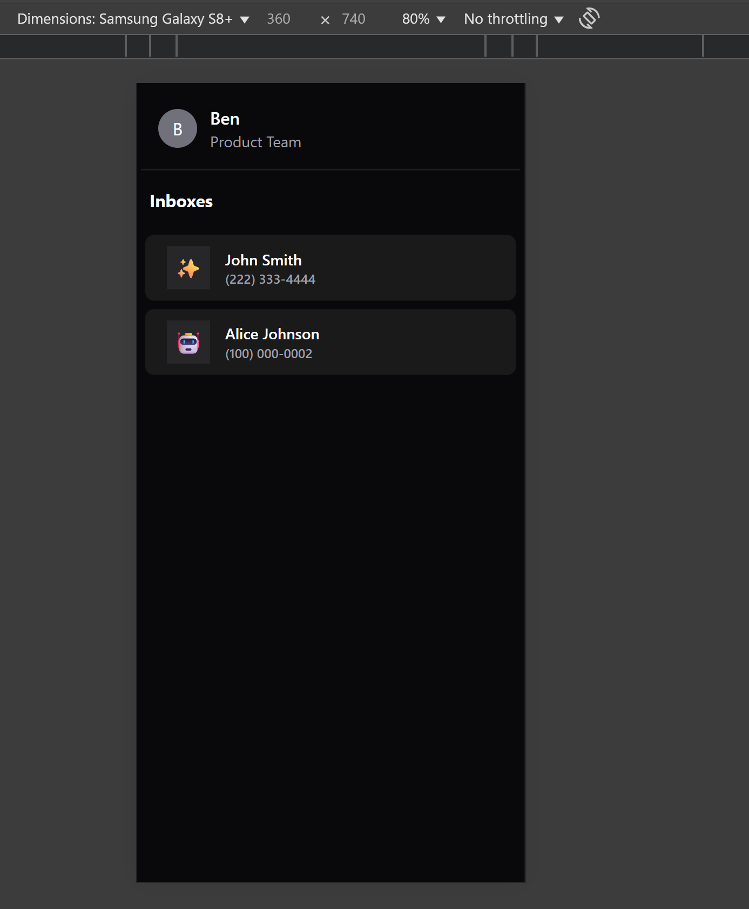
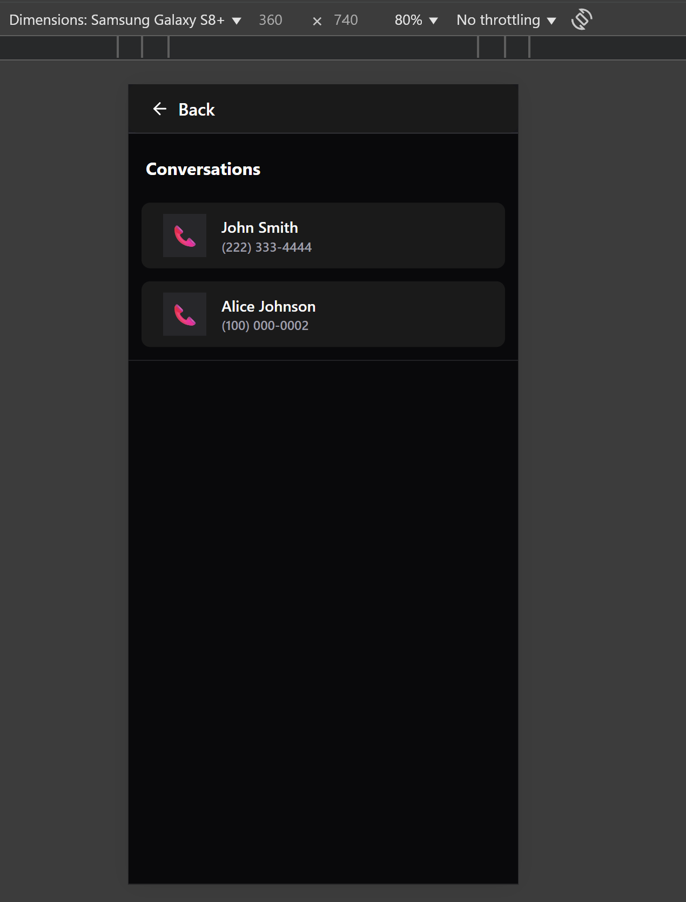
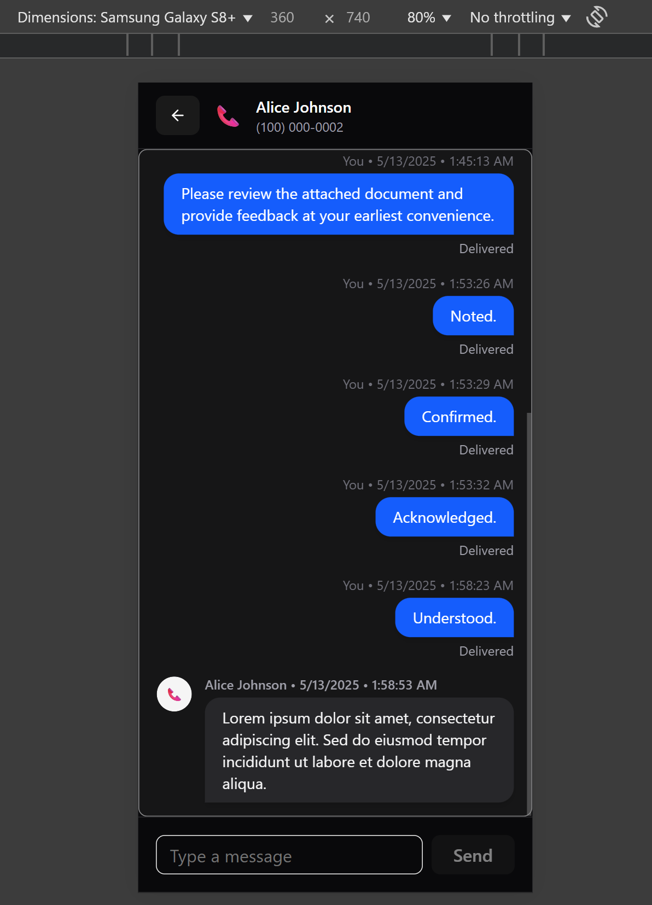

# Conversation UI - Mock (Frontend Messaging Demo)

A responsive, full-featured chat UI simulating a real messaging experience with mocked API data and a lightweight Express proxy.

> ⚠️ This is a standalone demo project using entirely mocked data. All interactions are simulated for frontend showcase purposes.
Disclaimer: This project was self-built based on a public take-home prompt. It contains no proprietary code, logic, or API credentials.


## Screenshots

<details>

<summary>Click to view screenshots</summary>







</details>

## Key Features

- Bi-directional chat: send and receive text messages
- Optimistic UI: outgoing messages render instantly
- Polling (5s) for incoming messages
- Pagination on scroll-up to load message history
- Scroll preservation when fetching older messages
- Timestamped bubbles with sender/receiver context
- Basic input validation and error handling
- Responsive layout with three-panel routing structure
- Lightweight state handled with composable hooks
- Fully mocked backend and message data

## Quick Start / Setup Instructions

This project runs entirely in mock mode — no API key is needed.

1. Clone the repository.
2. (Optional) Add a personal test contact in `src/utils/testContacts.ts` for local testing.
3. Install dependencies:
   ```
   npm install
   ```
4. Start the Vite frontend:
   ```
   npm run dev
   ```
5. (Optional) Start the mocked Express backend: (Note: Backend server is stubbed and mocked. No api key required.)
   ```
   cd server
   npm install
   npm run server
   ```
6. To run tests:
   ```
   npm run test
   ```
7. To run tests in watch mode:
   ```
   npm run test:watch
   ```

## Architecture

The application is structured into two main parts: the frontend and the backend.

### Frontend

Stack: React, Vite, TypeScript, Tailwind CSS, Shadcn UI, React Router

We follow separation of concerns:

- **Hooks**: All data fetching logic (fetching, messages, polling, sending) is abstracted into custom hooks (`useMessages`, `useSendMessage`, `usePhoneNumbers`) for testability and reusability.

- **Components**: UI is split into clean, focused components (`TopBar`, `MessageList`, `MessageInput`, etc.)

- **Utils**: Shared logic for util helpers.

### Backend (Mocked)

Stack: Node.js + Express.js + TypeScript

Note:

- All routes currently return mocked data to simulate interaction
- Real API logic is commented out and not active

🛠️ Built for demonstration purposes. No real data or credentials required.  

